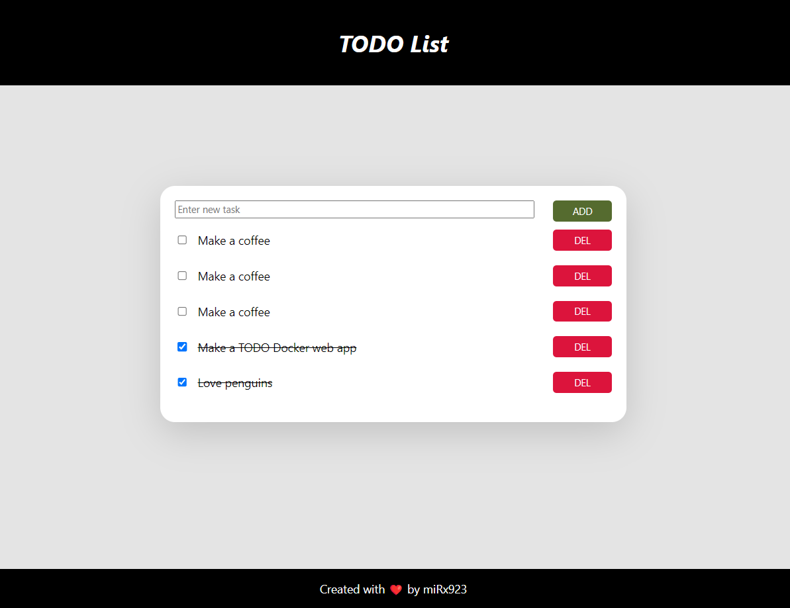

<h1 align=center>TODO Web Application 📋✍️</h1>

&emsp;&emsp;Containerized Flask TODO web application using HTML and CSS for visualization and PostgreSQL database for storing and managing the TODO list. The application consists of two Docker containers.

### List of Technologies Used:

- 🐳 Docker
- 🐧 Alpine Linux
- 🐍 Python 3.8
- 🍾 Flask
- 🔠 PostgreSQL
- 👁️ HTML
- 👁️ CSS

### Usage
#### Starting the Application:
&emsp;&emsp;The script will create all containers, container images, networks, etc.

- <b>PowerShell (Windows):</b> Run <code>./scripts/ps_scripts/start-app.ps1</code>

- <b>Command Prompt (Windows):</b> 1. Navigate to the folder <code>/scripts/cmd_scripts</code> 2. Run <code>start-app.bat</code>

- <b>Bash (Linux):</b> Run <code>./scripts/bash_scripts/start-app.sh</code>

 

#### Stopping + Deleting:
&emsp;&emsp;The script will delete all containers, container images, networks, etc.

- <b>PowerShell (Windows):</b> Run <code>./scripts/ps_scripts/end-app.ps1</code>

- <b>Command Prompt (Windows):</b> 1. Navigate to the folder <code>/scripts/cmd_scripts</code> 2. Run <code>end-app.bat</code>

- <b>Bash (Linux):</b> Run <code>./scripts/bash_scripts/end-app.sh</code>

 

#### Opening the Web Application:
&emsp;&emsp;Open in a browser <code>http://127.0.0.1:5000/</code>

 

#### Deleting the Database:
&emsp;&emsp;After using the application, you can delete the database (folder "db") using the script or manually.

- <b>PowerShell (Windows):</b> Run <code>./scripts/ps_scripts/rm-db.ps1</code>

- <b>Command Prompt (Windows):</b> 1. Navigate to the folder <code>/scripts/cmd_scripts</code> 2. Run <code>rm-db.bat</code>

- <b>Bash (Linux):</b> Run <code>./scripts/bash_scripts/rm-db.sh</code>

<h2 align=center>Thank you so much for using my application ❤️🐳</h2>
